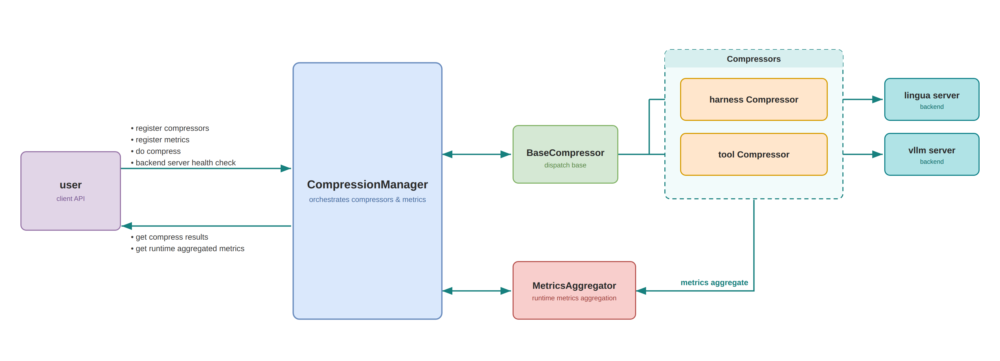
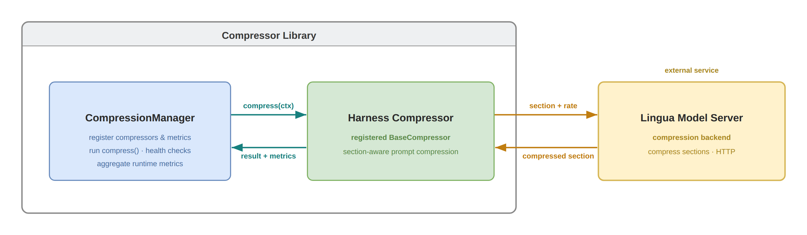
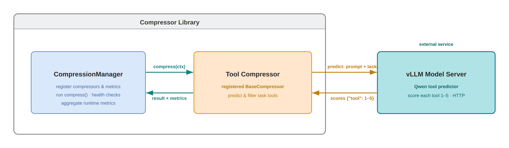

# Adaptive Token Compressor — Guide

This guide covers installation, a quick start, single-compressor metrics collection, multi-compressor usage,
compressor principles and workflow, configuration reference, available metrics,
testing, FAQ, and resources.

## Table of Contents

- [Prerequisites](#prerequisites)
- [Installation](#installation)
- [Quick Start](#quick-start)
- [Configuration](#configuration)
  - [Lingua Server Configuration](#lingua-server-configuration)
  - [HarnessCompressor Configuration](#harnesscompressor-configuration)
  - [ToolCompressor Configuration](#toolcompressor-configuration)
- [Compressor Principles](#compressor-principles)
  - [HarnessCompressor](#harnesscompressor)
  - [ToolCompressor](#toolcompressor)
- [Available Metrics](#available-metrics)
  - [First-Order Metrics (Direct Aggregation)](#first-order-metrics-direct-aggregation)
  - [Second-Order Metrics (Per-Call Averages)](#second-order-metrics-per-call-averages)
  - [Third-Order Metrics (Per-Request Averages)](#third-order-metrics-per-request-averages)
- [Single-Compressor Metrics Collection with CompressionManager](#single-compressor-metrics-collection-with-compressionmanager)
- [Multi-Compressor Usage with CompressionManager](#multi-compressor-usage-with-compressionmanager)
- [Testing](#testing)
- [Resources](#resources)

## Prerequisites

This library requires the following services:

1. **Lingua Server**  - Required for text compression in HarnessCompressor
2. **LLM for Tool Prediction** - Required for ToolCompressor.

   You can either:

   - Use your main LLM (e.g., vLLM serving Qwen/Qwen3.6-35B-A3B) for both
     inference and tool prediction.
   - Deploy a separate model dedicated to tool selection.

Both services must be deployed before using the compression features.

## Installation

```bash
pip install .
```

After installing adaptive-token-compressor, please deploy Lingua Server & Tool
Prediction using Docker (see [Deploy Lingua Server](./lingua-deployment.md) and
[Deploy LLM for Tool Prediction](./tool-predictor-deployment.md)).

### Development Installation

For local development, install in editable mode with the `dev` extras (pytest, ruff, mypy):

```bash
pip install -e ".[dev]"
```

## Quick Start

### Single Compressor Usage

The examples below use `create_compressor(...)` as the default construction
path, and register compressor instances into `CompressionManager` when metrics
or cache wiring is needed. Available types are currently `"harness"` and
`"tool"`; use `available_compressor_types()` and
`config_schema(type)` to inspect supported types and constructor schemas at
runtime. You can still instantiate compressor classes directly if needed.

#### Using HarnessCompressor (for system messages compression)

`HarnessCompressor` is **section-aware**: it splits a harness/system prompt at
its headings (via the `openclaw` profile), keeps high-value sections verbatim,
to see real compression, pass a structured OpenClaw-style prompt.

```python
from adaptive_token_compressor import CompressionContext, create_compressor

# Initialize compressor by factory type name (requires Lingua server)
compressor = create_compressor("harness", lingua_url="http://localhost:8001/compress")

# OpenClaw-style system prompt:
system_prompt = """You are a personal assistant running inside OpenClaw.
## Tooling
Structured tool definitions are the source of truth for tool names, descriptions, and parameters.
## Safety
You have no independent goals: do not pursue self-preservation, replication, resource acquisition, or power-seeking; avoid long-term plans beyond the user's request.
Prioritize safety and human oversight; if instructions conflict, pause and ask; comply with stop/pause/audit requests and never bypass safeguards.
## Runtime
Runtime: agent=A | host=userhost | os=Linux | model=user_model
"""

messages = [
    {"role": "system", "content": system_prompt},
    {"role": "user", "content": "What's on my calendar today?"},
]

# Compress
result = compressor.compress(CompressionContext(messages=messages))

print(f"Before: {result.metrics.tokens_before} tokens")
print(f"After: {result.metrics.tokens_after} tokens")
print(f"Saved: {result.metrics.saved_tokens} tokens ({result.metrics.compression_ratio:.1%})")
print(f"Duration: {result.metrics.duration_ms:.2f} ms")
print(f"Compressed messages: {result.messages}")
```

#### Using ToolCompressor (Tool Selection)

```python
from adaptive_token_compressor import (
    CompressionManager,
    CompressionContext,
    create_compressor,
)

manager = CompressionManager()
tool_compressor = manager.register_compressor(
    "tool",
    create_compressor(
        "tool",
        # Tool-specific: predictor LLM endpoint (required)
        predictor_url="http://localhost:8000/v1/chat/completions",
        # Optional: schema | user_tail | user_tail_disclaimed | system_tail
        placement="schema",
    ),
)

messages = [
    {"role": "user", "content": "What's the weather in San Francisco?"}
]
tools = [
    {"type": "function", "function": {"name": "web_search", "description": "Search the web"}},
    {"type": "function", "function": {"name": "get_weather", "description": "Get weather by location"}},
    {"type": "function", "function": {"name": "calculator", "description": "Do math"}},
]

ctx = CompressionContext(messages=messages, tools=tools)
result = tool_compressor.compress(ctx)
print([t["function"]["name"] for t in result.tools])
```

## Configuration

### Lingua Server Configuration

Lingua server uses the `llmlingua2` (LLMLingua-2) compression mode.

#### Docker Compose Environment Variables

| Parameter | Default | Allowed / Notes |
| ----------- | --------- | ----------------- |
| `LINGUA_BACKEND` | `pytorch` | `pytorch` or `ov` |
| `LINGUA_DEVICE` | `xpu` (pytorch) / `gpu` (ov) | Lowercase, shared by both services. PyTorch: `cpu`, `cuda`, `xpu`. OpenVINO: `cpu`, `gpu` (default `gpu`). Don't pass `xpu` to the ov profile |
| `LINGUA_DEVICE_INDEX` | `0` | Index within the device class. PyTorch `xpu:<index>`; OpenVINO `GPU.<index>` (generic `GPU` fallback for index `0`). Ignored for `cpu` |
| `LINGUA_MODE` | `llmlingua2` | Compression mode: `llmlingua2` |
| `LINGUA_MODEL_NAME_ID` | empty | Optional fixed model id. Empty -> mode default |
| `LINGUA_PORT` | `8001` | Host port mapping for `lingua-pytorch` service |
| `LINGUA_OV_PORT` | `8002` | Host port mapping for `lingua-ov` service |
| `LINGUA_HOST` | `localhost` | Bind address for the container service |

Default model when `LINGUA_MODEL_NAME_ID` is empty:

- `llmlingua2` -> `microsoft/llmlingua-2-bert-base-multilingual-cased-meetingbank`

### HarnessCompressor Configuration

| Parameter | Type | Default | Description |
|-----------|------|---------|-------------|
| `profile` | str | `"openclaw"` | Compression profile (sectioning strategy) |
| `lingua_url` | str | `"http://localhost:8001/compress"` | Lingua server URL |
| `compress_rate` | float | `0.5` | Target compression rate (0.0-1.0) |
| `compress_min_chars` | int | `500` | Minimum chars to trigger compression |
| `timeout` | float | `60.0` | Backend request timeout (seconds) |
| `enable_quantum_lock` | bool | `False` | Enable Claw Compactor QuantumLock stabilization |

**Example:**

```python
from adaptive_token_compressor.harness import HarnessCompressor

compressor = HarnessCompressor(
    profile="openclaw",
    lingua_url="http://localhost:8001/compress",
    compress_rate=0.5,
    compress_min_chars=500,
    timeout=60.0
)
```

### ToolCompressor Configuration

| Parameter | Type | Default | Description |
| ----------- | ------ | --------- | ------------- |
| `predictor_url` | str | **Required** | Tool predictor LLM endpoint (e.g., vLLM `/v1/chat/completions`) |
| `predictor_model` | str | `"Qwen/Qwen3.6-35B-A3B"` | Model used by predictor |
| `score_threshold` | float | `3.0` | Minimum score for tool selection |
| `timeout` | int | `120` | Predictor request timeout (seconds) |
| `prompt_mode` | Literal | `"dynamic"` | `"static"` (fixed prompt) or `"dynamic"` (context-aware prompt) |
| `tool_descriptions_mode` | Literal | `"dynamic"` | `"static"` (default descriptions) or `"dynamic"` (extract from messages) |
| `placement` | Literal | `"schema"` | Where the predicted tool schema is placed. See **Placement modes** below. |
| `accumulate` | bool | `True` | Union the predicted tool set per conversation (append-only, never removed/reordered) so each turn's tool block is a strict prefix-extension of the previous turn's — keeping the prefix cache stable while still admitting tools that only emerge in later turns. Required by `user_inline_delta`. |

**Placement modes:**

- `"schema"` (default, production): predicted subset returned in `result.tools`,
  rendered inside the system message's `<tools>` block by the chat template.
- `"user_inline_delta"`: tools appended as a trailing synthetic user message.
  The carrier is persisted per-conversation and re-spliced at a fixed offset
  each turn (prefix-cache stable), but delta-only — appends a carrier only when
  new tools appear, carrying just the delta over the running union.
  Requires `accumulate=True`.

**Note:**

- `schema` + `accumulate=True`: reduces tool-schema tokens while keeping the
  prefix-cache hit rate from dropping significantly.
- `user_inline_delta` + `accumulate=True`: reduces tokens while further
  improving the prefix-cache hit rate (still lower than baseline). This depends
  on the tool-predictor model's own capability; verified to run stably on Qwen3.5-35B.

**Example:**

```python
from adaptive_token_compressor.tool import ToolCompressor

compressor = ToolCompressor(
    predictor_url="http://localhost:8000/v1/chat/completions",
    predictor_model="Qwen/Qwen3.6-35B-A3B",
    score_threshold=3.0,
    timeout=120,
    prompt_mode="dynamic",
    tool_descriptions_mode="dynamic",
    placement="schema"
)
```

## Compressor Principles

This section explains how each compressor works conceptually and what the
runtime pipeline looks like.



### HarnessCompressor

**Principle**:

HarnessCompressor focuses on conversation-message compression for the prompt
assembly stage. It combines lightweight rules (message slicing / role-aware
handling) with Lingua-based lossy compression for long text blocks, reducing token
cost while preserving instruction-critical content.



### ToolCompressor

**Principle**:

ToolCompressor reduces tool-schema prompt cost by selecting only likely-needed
tools for the current request. It uses an external predictor LLM to score tool
relevance from conversation context, then keeps high-value tools only.
The ToolCompressor supports configurable tool-injection placements to flexibly
trade off token savings against prefix-cache hit rate.



## Available Metrics

The library provides 15 metric types for tracking compression performance.
Most metrics require a `sources` parameter specifying which compressor(s) to
track (e.g., `"harness"`, `"tool"`, or `["harness", "tool"]`). The exception is
 `RequestCount`, which is source-agnostic.

### First-Order Metrics (Direct Aggregation)

| Metric | Description | Formula |
| -------- | ------------- | --------- |
| `CallCount` | Total number of compression calls | Sum of all calls |
| `TotalInput` | Total input tokens | Sum of `tokens_before` |
| `TotalOutput` | Total output tokens | Sum of `tokens_after` |
| `TotalSaved` | Total tokens saved | Sum of `saved_tokens` |
| `TotalDuration` | Total compression time | Sum of `duration_ms` |

**Example:**

```python
manager.register_metric("total_calls", CallCount(sources="harness"))
manager.register_metric("total_saved", TotalSaved(sources=["harness", "tool"]))
```

### Second-Order Metrics (Per-Call Averages)

| Metric | Description | Formula |
| -------- | ------------- | --------- |
| `CompressionRatio` | Compression ratio (lower = better) | `sum(tokens_after) / sum(tokens_before)` |
| `AvgSavedPerCall` | Average tokens saved per call | `sum(saved_tokens) / call_count` |
| `AvgDurationPerCall` | Average duration per call | `sum(duration_ms) / call_count` |
| `AvgInputPerCall` | Average input tokens per call | `sum(tokens_before) / call_count` |
| `AvgOutputPerCall` | Average output tokens per call | `sum(tokens_after) / call_count` |

**Example:**

```python
manager.register_metric("ratio", CompressionRatio(sources="harness"))
manager.register_metric("avg_saved", AvgSavedPerCall(sources="tool"))
```

### Third-Order Metrics (Per-Request Averages)

These require passing `req_id` to `compress()` or using `manager.set_per_anchor()`.

| Metric | Description | Formula |
| -------- | ------------- | --------- |
| `AvgSavedPerRequest` | Average tokens saved per request | `sum(saved_tokens) / unique_requests` |
| `AvgDurationPerRequest` | Average duration per request | `sum(duration_ms) / unique_requests` |
| `AvgInputPerRequest` | Average input tokens per request | `sum(tokens_before) / unique_requests` |
| `AvgOutputPerRequest` | Average output tokens per request | `sum(tokens_after) / unique_requests` |
| `RequestCount` | Number of unique requests (source-agnostic) | `len(unique req_ids)` (or anchor count) |

> **Note**: `RequestCount` is the only metric without a `sources` parameter — it counts requests across the whole manager, not per-compressor calls. Construct it with no arguments: `RequestCount()`.

**Example:**

```python
manager.register_metric("avg_per_req", AvgSavedPerRequest(sources="harness"))
manager.register_metric("request_count", RequestCount())  # no sources arg

# Option 1: Pass req_id explicitly
harness_compressor.compress(ctx, req_id="request-123")

# Option 2: Use anchor fallback
manager.set_per_anchor("harness")
```

## Single-Compressor Metrics Collection with CompressionManager

Metrics collection requires using `CompressionManager`. Register a single
compressor, attach metrics, and read the aggregated snapshot:

```python
from adaptive_token_compressor import (
    CompressionManager,
    CompressionContext,
    create_compressor,
    CompressionRatio,
    TotalSaved
)

# Metrics collection requires using CompressionManager
manager = CompressionManager()

# Register compressor first
harness_compressor = manager.register_compressor(
    "harness",
    create_compressor("harness", lingua_url="http://localhost:8001/compress"),
)

# Then register metrics with names
manager.register_metric("compression_ratio", CompressionRatio(sources="harness"))
manager.register_metric("total_saved", TotalSaved(sources="harness"))

# Compress multiple requests
for i in range(5):
    messages = [...]  # Different messages each time
    ctx = CompressionContext(messages=messages)
    result = harness_compressor.compress(ctx)

# View aggregated metrics (returns dict with all registered metric names)
stats = manager.snapshot()
print(f"Compression ratio: {stats['compression_ratio']:.2%}")
print(f"Total saved: {stats['total_saved']} tokens")
```

## Multi-Compressor Usage with CompressionManager

Metrics support both **per-source** tracking (single source string) and
**cross-compressor aggregation** (list of sources). Cross-compressor metrics
let you track combined statistics — e.g. average duration per request across
the harness and tool compressors together.

```python
from adaptive_token_compressor import (
    CompressionManager,
    CompressionContext,
    create_compressor,
    TotalSaved,
    AvgDurationPerRequest,
)

# Initialize manager
manager = CompressionManager()

# Register compressors first
harness_compressor = manager.register_compressor(
    "harness",
    create_compressor("harness", lingua_url="http://localhost:8001/compress"),
)
tool_compressor = manager.register_compressor(
    "tool",
    create_compressor(
        "tool",
        predictor_url="http://localhost:8000/v1/chat/completions",
    ),
)

# Register one per-source metric plus two aggregate metrics
manager.register_metric(
    "harness_saved",
    TotalSaved(sources="harness")
)
manager.register_metric(
    "total_saved_all",
    TotalSaved(sources=["harness", "tool"])
)
manager.register_metric(
    "avg_dur_per_request_all",
    AvgDurationPerRequest(sources=["harness", "tool"])
)

# Process multiple requests
for i in range(10):
    messages = [...]  # Different messages each time
    tools = [...]     # Full tool list

    # IMPORTANT: use the SAME req_id for all compressors in one request so
    # request_count() counts unique requests, not per-compressor calls. This
    # makes avg_dur_per_request_all = total duration / number of requests.
    req_id = f"req-{i}"

    ctx = CompressionContext(messages=messages, tools=tools)

    # Compress tools
    result = tool_compressor.compress(ctx, req_id=req_id)
    ctx = CompressionContext(messages=result.messages, tools=result.tools)

    # Compress messages
    result = harness_compressor.compress(ctx, req_id=req_id)

    # Use result.messages and result.tools for LLM inference

# View aggregated metrics (snapshot returns all registered metrics)
stats = manager.snapshot()

print(f"  Harness saved: {stats['harness_saved']} tokens")
print(f"  Total saved (all): {stats['total_saved_all']} tokens")
print(f"  Avg duration per request (all): {stats['avg_dur_per_request_all']:.1f} ms")
```

> **Note:** The PerRequest metrics (`AvgDurationPerRequest`, `AvgSavedPerRequest`,
> etc.) divide by the number of unique requests. You must either pass `req_id` to
> `compressor.compress(ctx, req_id=...)` (as above), or call
> `manager.set_per_anchor("<source>")` to use one compressor's call count as
> the request denominator. Without either, `manager.snapshot()` raises a
> `RuntimeError` (the denominator is checked at snapshot time, not at registration).

## Testing

```bash
# Run all tests
pytest

# Specific module
pytest tests/core/test_metrics.py

# With coverage
pytest --cov=adaptive_token_compressor
```

## Resources

- [LLMLingua-2: Data Distillation for Efficient and Faithful Task-Agnostic Prompt Compression](https://arxiv.org/abs/2403.12968)
- [Lingua Deployment Guide](lingua-deployment.md)
- [Tool Predictor Setup](tool-predictor-deployment.md)