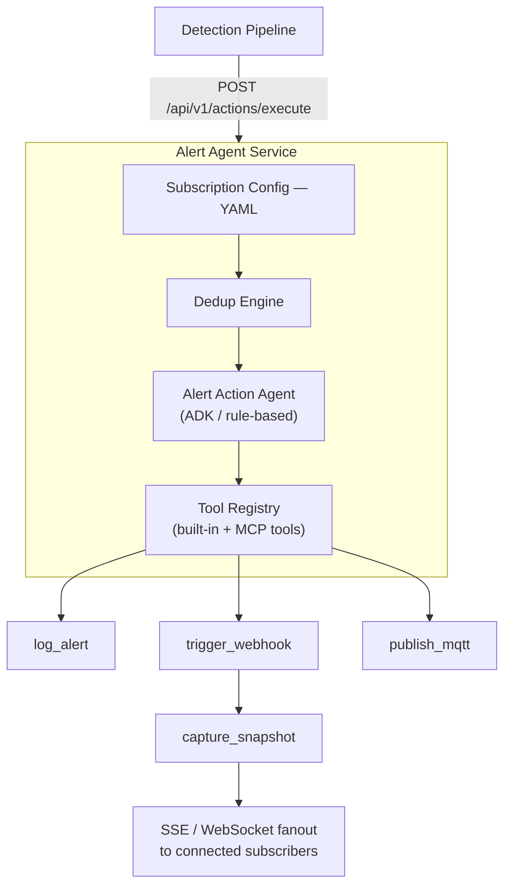

# How It Works

This article provides a detailed overview of the internal architecture, components, and data
flow of the Alert Agent Service. It is intended for developers and system integrators who want
to understand how the service processes alert events, reasons over them, and dispatches actions.

## Architecture

The service exposes a FastAPI-based REST API and supports two dispatch modes:

- **ADK mode (default)**: Uses Google Agent Development Kit (ADK) backed by an OpenVINO™ Model Server (OVMS) LLM to reason over the alert and invoke tools autonomously.
- **Rule-based mode**: Directly invokes the ordered list of tools specified in the request or subscription configuration without LLM reasoning.

The following diagram illustrates the high-level architecture and data flow:

## Components

### Core Components

1. **FastAPI Service Layer**
   - **Description**: Primary entry point for client interactions. Exposes a RESTful API for dispatching alert actions, streaming events, and managing tools.
   - **Functions**:
     - Accepts multimodal alert payloads (text, image, audio, video, binary).
     - Routes requests through the dedup engine, subscription config, and agent dispatcher.
     - Fans out processed events to SSE and WebSocket subscribers.
     - Provides OpenAPI (Swagger) documentation at `/docs`.

2. **Alert Action Agent**
   - **Description**: The central dispatch component that orchestrates tool invocation in either ADK (LLM-reasoned) or rule-based mode.
   - **Functions**:
     - In ADK mode: uses an LLM (served by OVMS) to decide which tools to invoke and in what order.
     - In rule-based mode: directly invokes the ordered tool list from the request or subscription config.
     - Handles escalation logic — invokes additional tools when a consecutive-detection threshold is reached.

3. **Subscription Configuration**
   - **Description**: YAML-based default routing rules that map alert names to tool lists, dedup settings, and escalation policies.
   - **Functions**:
     - Provides per-alert-name defaults for tools, tool arguments, dedup, and escalation.
     - Per-request fields override these defaults, allowing fine-grained control.

4. **Deduplication Engine**
   - **Description**: Prevents duplicate alert actions within a configurable time window.
   - **Functions**:
     - Supports `field_hash` strategy — hashes specified alert context fields and suppresses repeat events within the window.
     - Configurable per-alert in subscription config or per-request.

5. **Tool Registry**
   - **Description**: Dynamic registry of all available action tools (built-in and MCP-discovered).
   - **Functions**:
     - Loads built-in tools from `resources/tools.json` at startup.
     - Discovers additional tools from configured MCP servers.
     - Supports hot-reload without service restart (`POST /api/v1/tools/reload`).

6. **MCP Client**
   - **Description**: Model Context Protocol (MCP) client that connects to external MCP servers and exposes their tools as first-class actions.
   - **Functions**:
     - Connects to HTTP-based MCP servers defined in `resources/mcp_servers.json`.
     - Registers discovered tools into the Tool Registry.
     - Supports runtime reconnection and tool refresh (`POST /api/v1/mcp/reload`).

7. **Event Manager (SSE + WebSocket)**
   - **Description**: Real-time event broadcasting to connected clients after each dispatch.
   - **Functions**:
     - SSE stream at `GET /api/v1/events` — emits `alert_action`, `init`, `keepalive`, and `error` events.
     - WebSocket stream at `GET /api/v1/ws` — mirrors the same events.

### Built-in Action Tools

| Tool               | Description                                                                      | Required Configuration |
| ------------------ | -------------------------------------------------------------------------------- | ---------------------- |
| `log_alert`        | Logs the alert event to application logs                                         | None                   |
| `trigger_webhook`  | HTTP POST to a configurable external endpoint, with optional HMAC-SHA256 signing | `WEBHOOK_URL`          |
| `capture_snapshot` | Saves the image payload from the request to disk                                 | `SNAPSHOT_DIR`         |
| `publish_mqtt`     | Publishes the alert to an MQTT broker topic                                      | `MQTT_BROKER`          |

## Integration

The service can be integrated into applications through:

- REST API calls
- Docker container deployment
- Docker Compose orchestration

## Limitations

- OVMS LLM startup can take several minutes; the agent service waits for OVMS to become healthy before starting.
- ADK mode requires a compatible chat-completion endpoint (OpenAI-compatible, served by OVMS).
- For CPU-only Intel devices, set `TARGET_DEVICE=CPU` — inference latency will be higher than GPU but the full ADK pipeline remains functional.
- MCP server connections are HTTP-based; stdio/process-based MCP transports are not currently supported.
- The `capture_snapshot` tool only saves disk snapshots when the image payload is provided with `encoding=base64`; URI-based payloads are logged but not downloaded.
