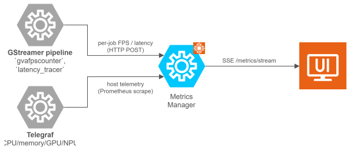

# Metrics

ViPPET reports two complementary families of runtime metrics, both routed
through the **`metrics-manager`** microservice and streamed to the UI over a
single Server-Sent Events (SSE) channel at `/metrics/stream`:

- **[Pipeline Performance](./metrics/pipeline-performance.md)** — per-job throughput
  (FPS) and end-to-end latency emitted by the GStreamer pipeline itself
  (`gvafpscounter`, `latency_tracer`). Each sample is tagged with `job_id`
  and `stream_id`, so the dashboard can display per-job and per-stream
  values rather than a single global number.
- **[System Performance](./metrics/system-performance.md)** — host-level utilization
  (CPU, memory, GPU, NPU) collected continuously by Telegraf embedded in the
  `metrics-manager` container, independently of any pipeline run.

Both data sources share the same delivery path, retention window and UI
transport, which keeps the dashboard simple and consistent.

<!--hide_directive
:::{toctree}
:hidden:

./metrics/pipeline-performance
./metrics/system-performance

:::
hide_directive-->