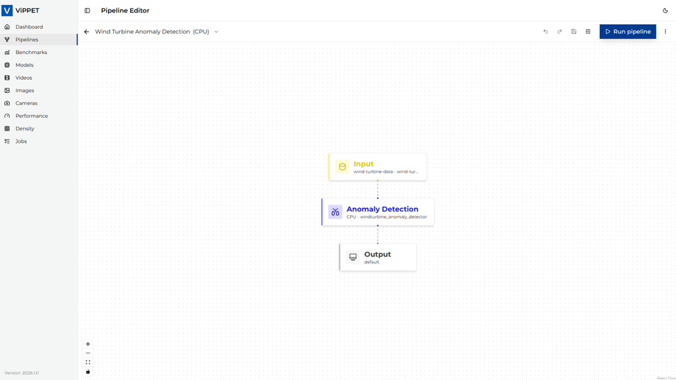
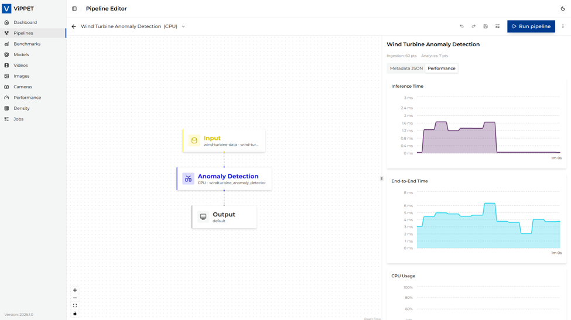

# Deploy Time Series Analytics Microservice

This guide describes how to build, start, and stop the Time Series Analytics Microservice (TSAM)
as part of the ViPPET stack, and how to configure it with a sample Wind Turbine anomaly
detection UDF.

## Prerequisites

- Docker and Docker Compose installed
- `make` available on the host
- `wget` installed (required to download UDF packages)

> Time Series Analytics can run on CPU or GPU, but NPU is not supported.

## Activate the Experimental Time Series stack

The Time Series Analytics Microservice is started from the experimental compose stack.
Use the project Makefile targets from the tool root directory:

```bash
cd tools/visual-pipeline-and-platform-evaluation-tool
```

Activation is performed with the
`build-experimental` and `run-experimental` targets.

### Build the experimental stack

Build all required Docker images:

```bash
make build-experimental
```

### Start the experimental stack

Start all services, including the Time Series Analytics Microservice:

```bash
make run-experimental
```

This command enables the Time Series flow by layering `compose.experimental.yml` on top of the standard
compose stack, including `ia-time-series-analytics-microservice` and `ia-timeseries-ingestion`.

### Verify that Time Series services are active

Check if both Time Series services are running:

```bash
docker ps --format '{{.Names}}' | grep -E 'ia-time-series-analytics-microservice|ia-timeseries-ingestion'
```

### Stop and Clean

Stop all running services and clean any artifacts:

```bash
make stop-experimental
make clean-experimental
```

---

## Deploy the Wind Turbine anomaly detection UDF

Once the services are running, follow the steps below to deploy the Wind Turbine anomaly detection UDF into the TSAM.

The TSAM Swagger UI is available at **[http://localhost:5000/docs](http://localhost:5000/docs)**.

### Step 1. Download the UDF package

Download the pre-built Wind Turbine UDF tar archive:

```bash
wget https://raw.githubusercontent.com/open-edge-platform/edge-ai-resources/main/timeseries-udf-deployment-packages/wind-turbine-anomaly-detection.tar
```

### Step 2. Upload the UDF package

1. Open **[http://localhost:5000/docs](http://localhost:5000/docs)** in a browser.
2. Navigate to **POST /udfs/package**.
3. Click **Try it out**.
4. Under **Choose File**, select the downloaded `wind-turbine-anomaly-detection.tar` file.
  
5. Click **Execute**.

A successful response returns the message: `UDF deployment package 'wind-turbine-anomaly-detection.tar' uploaded successfully.`

### Step 3. Apply the configuration

1. Open **[http://localhost:5000/docs](http://localhost:5000/docs)** in a browser.
2. Navigate to **POST /config**.
3. Click **Try it out**.
4. In the **Request Body** field, paste the following configuration:

```json
{
    "udfs": {
        "name": "windturbine_anomaly_detector",
        "models": "windturbine_anomaly_detector.pkl",
        "device": "cpu"
    }
}
```

  

1. Click **Execute**.

A successful response returns the message: `Configuration updated successfully.`

---

### Step 4. Verify Time Series logs

Check that processing is running correctly:

```bash
docker logs -f ia-time-series-analytics-microservice
```

In a separate terminal, you can also verify ingestion activity:

```bash
docker logs -f ia-timeseries-ingestion
```

You should see output similar to the following:

```text
2026-05-26 04:43:45,599 - classifier_startup - INFO - Connected to Kapacitor on port 9092
2026-05-26 04:43:45,621 - classifier_startup - INFO - Kapacitor initialized successfully
2026-05-26 04:43:46,201 - classifier_startup - INFO - HTTP service listening on [::]:9092
2026-05-26 04:43:46,201 - classifier_startup - INFO - Started task windturbine_anomaly_detector
INFO: 172.18.0.7:52784 - "POST /input HTTP/1.1" 200 OK
INFO: 172.18.0.7:52786 - "POST /input HTTP/1.1" 200 OK
```

---

## Step 5. Verify the pipeline in the ViPPET UI

After TSAM services and UDF configuration are ready, verify the full flow in the UI.

### 5.1 Confirm the new pipeline appears on Dashboard

Open ViPPET in the browser and go to **Dashboard**. In the **Pipelines** section,
you should see the new **Wind Turbine Anomaly Detection** pipeline card.

<picture>
  <source media="(prefers-color-scheme: dark)" srcset="../../_assets/ViPPET-UI-Time-Series-Pipeline-dark.png">
  
</picture>

### 5.2 Open the Wind Turbine pipeline in Pipeline Editor

Click the **Wind Turbine Anomaly Detection** card to open Pipeline Editor.
You should see the flow:

- **Input**
- **Anomaly Detection**
- **Output**

<picture>
  <source media="(prefers-color-scheme: dark)" srcset="../../_assets/ViPPET-UI-Wind-Turbine-Pipeline-Editor-dark.png">
  
</picture>

### 5.3 Run pipeline and inspect runtime data

Click **Run pipeline** in the top-right corner.

In the right panel:

- In the **Performance** tab, verify charts are updating for, among others:
  - **Inference Time**
  - **End-to-End Time**
- In the **Metadata JSON** tab, verify ingestion payload includes values such as:
  - `grid_active_power`
  - `wind_speed`

<picture>
  <source media="(prefers-color-scheme: dark)" srcset="../../_assets/ViPPET-UI-Wind-Turbine-Charts-dark.png">
  
</picture>

<picture>
  <source media="(prefers-color-scheme: dark)" srcset="../../_assets/ViPPET-UI-Wind-Turbine-metrics-dark.png">
  
</picture>
