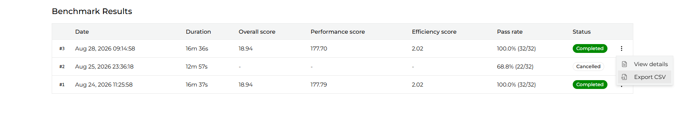
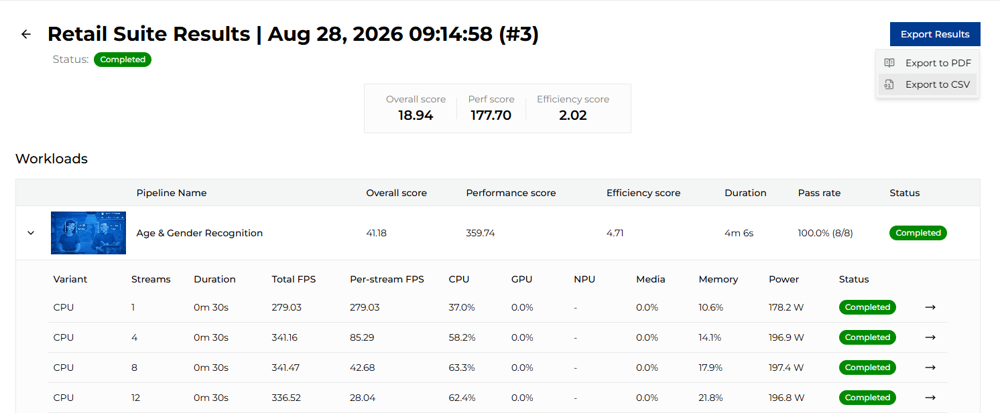

# Benchmark Export

You can export benchmark data only if the run is in status: *completed*. For completed benchmarks, the run history table shows the option to export data as CSV in the row action menu:

The same export option is also available on the benchmark run details page when the run is completed.

This button also offers export to PDF. It is based on the current browser view, so for a deterministic layout the CSV version is recommended. PDF output also follows the current light/dark mode.

## Exported file name

Exported files use the same naming pattern for both CSV and PDF: `<suite name>-results-<date YYYY-mm-dd-HH-MM-SS>-<run id>.<ext>`.
