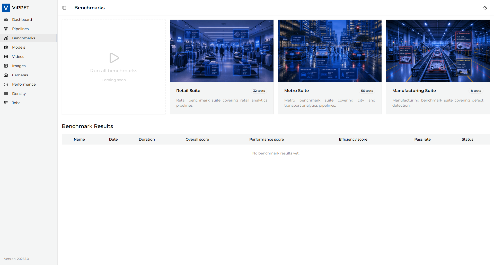
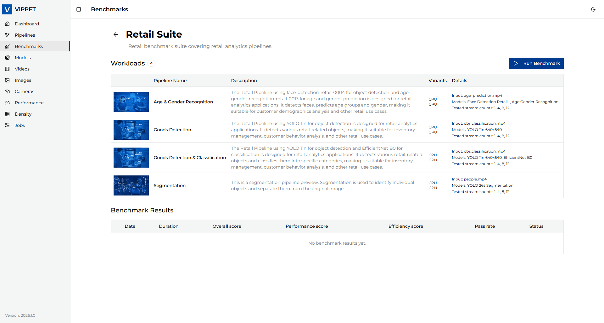
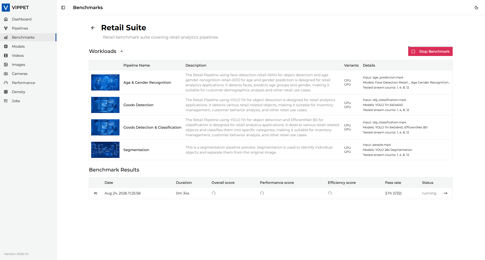
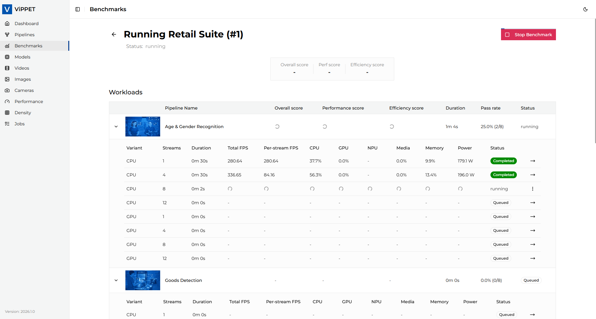
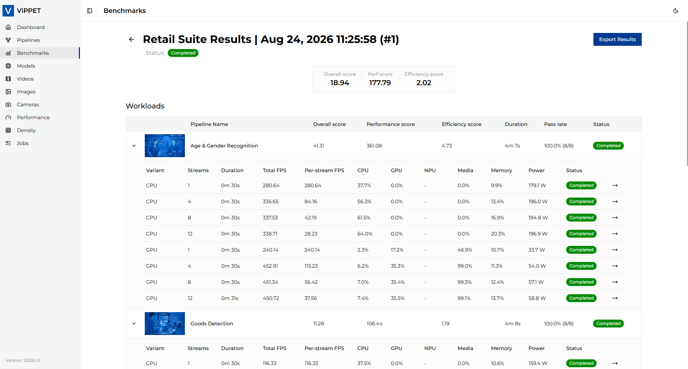

# Benchmark Suites

ViPPET is built with 3 predefined Benchmark Suites:

- Retail Suite: Retail benchmark suite covering retail analytics pipelines.
- Metro Suite: Metro benchmark suite covering city and transport analytics pipelines.
- Manufacturing Suite: Manufacturing benchmark suite covering defect detection.

Benchmark Suites are located on the left menu under "Benchmarks".

A benchmark suite is a repeatable evaluation plan for a single workload category such as retail, metro, or manufacturing. Each suite contains one or more workloads, and each workload defines a pipeline together with the concrete benchmark configurations, including the selected pipeline variant and stream count for each test. This allows ViPPET to compare the same use case across different hardware configurations and workload intensities.

Open the benchmark suite you want to run to see more details:

The suite detail view lists all pipelines (workloads) used in that benchmark, together with the variants selected for performance testing and the stream counts used for each test. The table also includes the pipeline description, input source, and model(s) used for the scenario. This view is useful for understanding not only what is being measured, but also which pipeline configuration is expected to perform best under different concurrency levels.

To run the selected benchmark suite, press the **Run Benchmark** button. Only one benchmark run can be active at a time. After the run starts, the button changes to **Stop Benchmark** so the execution can be interrupted manually if needed. ViPPET evaluates the configured performance tests in order, moving from the first workload to the last and executing each variant/stream-count combination in sequence.

During execution, the run details page lets you track progress and inspect the status of each active or completed performance test. The page updates as each workload and test case is started, finished, failed, cancelled, or skipped.

In the *Actions* column there is an arrow icon that reveals the details page.

Here you can inspect the live results of a particular performance test. Each row in the workload table reports:

- **Variant** - pipeline variant used for performance test
- **Streams** - number of streams passed to performance test payload
- **Durataion** - time of execution. The test should loop the video (if short) and process it for about 30 seconds
- **Total FPS** - main result of the test, shows the FPS avieved for current setup
- **Per stream FPS** - total FPS divided per number of streams
- **CPU** - CPU utilization during the test
- **GPU** - GPU utilization during the test
- **NPU** - NPU utilization during the test
- **Media** - Media utilization during the test
- **Memory** - Memory utilization during the test
- **Power** - Average power consumption during the test
- **Status** - one of:
    - **Queued** - test waiting to be executed
    - **Running** - currently running test
    - **Failed** - execution finished with an error
    - **Cancelled** - manually cancelled performance test execution
    - **Skipped** - test was not able to execude because of hardware missmatch

Running performance test can be cancelled by selecting *Cancel test* from actions menu of currently executed performance test. The data collected will be returned and calculated and test will be marked as *cancelled*. If at least one test is *cancelled* the workload will be set to *cancelled* and the whole benchmark run will also bo marked as *cancelled*.

When the benchmark run is *completed*, ViPPET calculates scores for each workload and for the full suite. A workload score is derived from all completed test-case results for that workload, and a suite score is derived from all completed workload results in that suite. This means the overall benchmark result reflects the full execution of the configured test matrix, not just a single best run.

## Benchmark scoring

When a benchmark run is completed, ViPPET calculates three scores for each workload and for the full suite:

- Performance score
- Efficiency score
- Overall score

### Performance score

The performance score shows raw throughput: how many frames per second the pipeline can process.

Formula: performance = total_fps

Higher is better. This answers the question: “How much work is the system doing?”

### Efficiency score

The efficiency score shows how effectively the system converts compute and power into throughput.

When power data is available, the score is calculated as:

efficiency = total_fps / power_watts

If power is not available, ViPPET falls back to utilization-based efficiency:

efficiency = total_fps / average_utilization_percent

where the average utilization is computed from the non-zero values of CPU, GPU, NPU, and media usage.

This rewards not only raw speed, but also efficient use of resources.

### Overall score

The overall score combines performance and efficiency into a single balanced value:

overall = sqrt(performance * efficiency)

This is a geometric mean, which prevents a workload with very high FPS but poor efficiency from dominating the result. It keeps the score balanced between throughput and resource efficiency.

### Aggregation

The same logic is used at all levels:

- Each test case produces a performance, efficiency, and overall score.
- A workload score is calculated from all passed test cases in that workload.
- A suite score is calculated from all passed workloads in that suite.

This makes the final suite score represent the combined result of all completed workload tests, while still preserving the component scores for analysis.

### How to interpret the results

Use the score components together, not in isolation:

- A high performance score means the pipeline handles a large number of frames per second.
- A high efficiency score means it delivers that throughput without wasting compute or power.
- A high overall score means the pipeline is both fast and efficient.

When comparing different variants or hardware configurations, start with the overall score, then inspect the performance and efficiency values to understand whether a result is driven by higher throughput, better resource usage, or both.

## Exporting

Benchmark results can be exported as CSV/PDF for reporting, documentation, or offline analysis. The export includes the run metadata and the per-workload, per-test-case results so you can inspect the full benchmark matrix outside the UI. Read more in the [benchmark export guide](./benchmark-export.md).
